# Lab 01: Getting Started with Microsoft Copilot for Sales

## Lab Overview

This lab introduces Microsoft Copilot for Sales, an AI assistant designed to enhance productivity and help sellers close more deals. You will learn how to integrate Microsoft Copilot within Microsoft 365 apps like Outlook, Teams and connect it seamlessly to Microsoft Dynamics 365 Sales and Salesforce Sales Cloud. The lab will demonstrate how Copilot provides sales-specific insights and recommendations, streamlining your workflow and maximizing sales efficiency.

## Lab Objectives

In this lab, you will perform:

- Task 1: Access the Sales app
- Task 2: Sign in to CRM from Outlook

## Task 1: Access the Sales app in Mail and Meeting Creations

In this task you will understand how to access and use Copilot for Sales in Outlook Mail, Calendar, and Microsoft Teams. It helps you integrate AI support for emails, meetings, and collaboration. The goal is to improve productivity and sales efficiency across Microsoft 365 tools.

1. In a new browser tab search for [Outlook](https://outlook.cloud.microsoft/mail/?deeplink=mail%2F) and sign in using the odl credentials provided in the Environment tab.

1. In Outlook, click on exisiting Mail **Microsoft Audio Conferencing**.

      
   
   Review the Mail Id from Microsoft.

      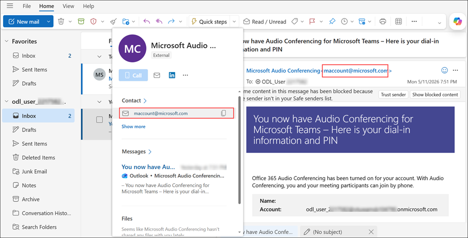

1. Mention the microsoft email you received in **To** field, click on **Insert (1)** , then click on **Apps (2)** and select **Sales (3)**.

   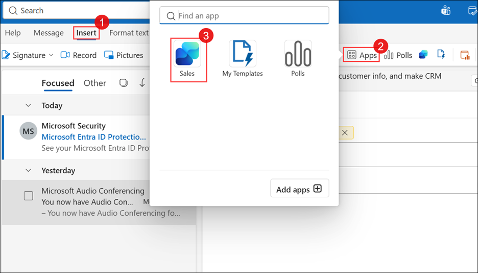

1. Click on **Sales** again.

   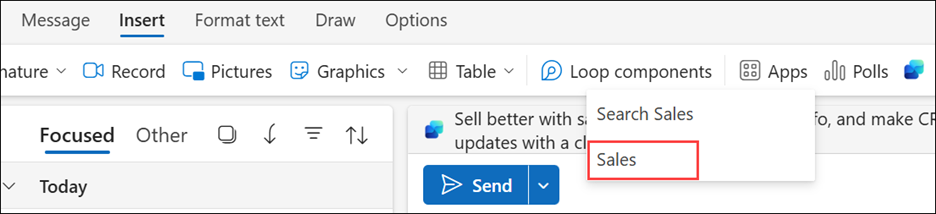

1. While reading an email, open any **customer mail**, then click **Apps** and select **Sales (4)**, if not already chosen.
   
      > **Note:** If Apps Icon is not visible click on **elipse (...)** inside the mail you will be able see **Apps**

1. To create a meeting, click **Calendar (1)** and select **New event (2)**.

    

1. Add the title as **Daily Scrum** in the **Title field (1)** and click on **Save (2)**.

    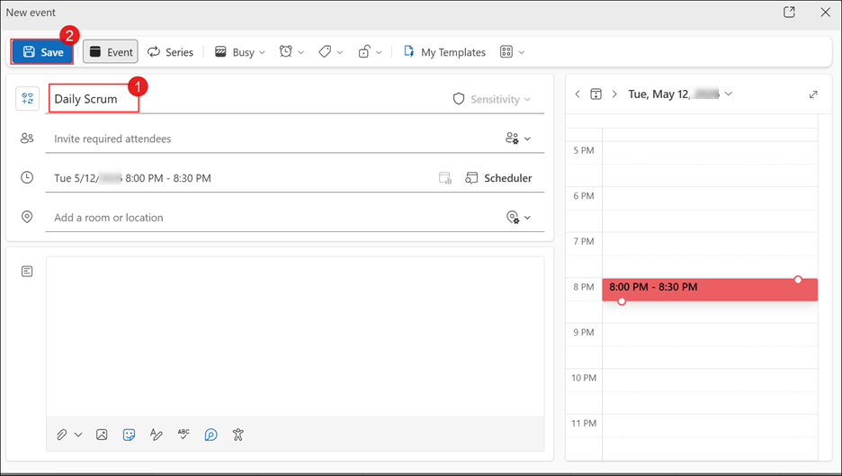
   
1. While opening a meeting, open **Calendar** in **Outlook** and select the **scheduled meeting** and proceed to **Edit**.
   
1. Select **More commands (...)** and then select **Sales** (in Simplified ribbon)

   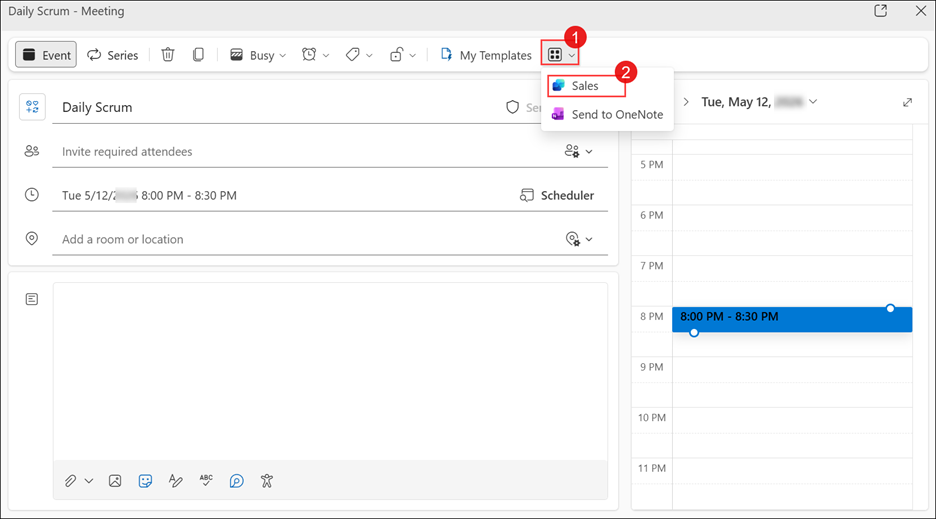

1. To access **Copilot for Sales in Teams**, navigate to https://teams.microsoft.com.

1. Select **Apps** , search for **Sales** and click on **Open**.
   
      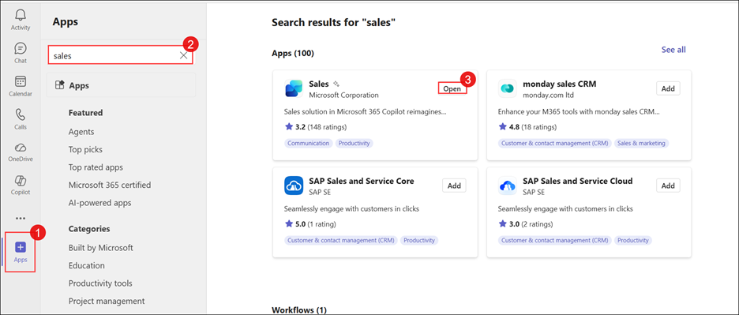

1. Click on **Add**.

    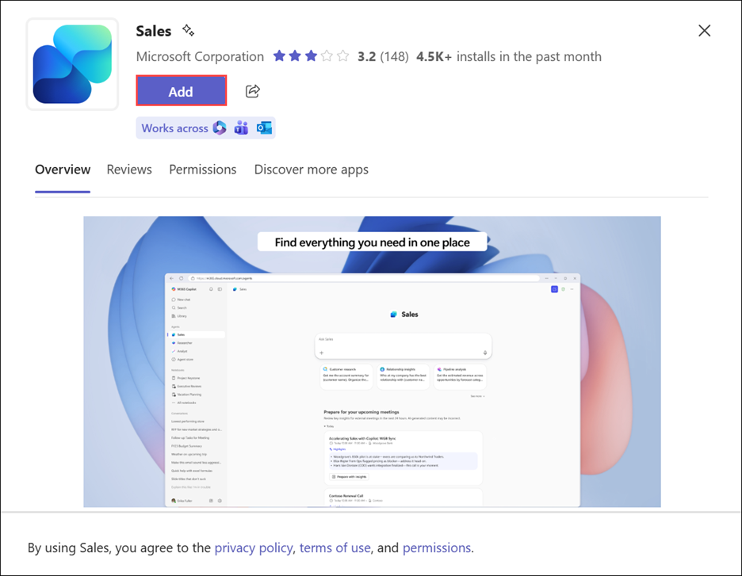
   
## Task 2: Sign in to CRM from Outlook

In this task, you will understand how to **switch the CRM environment in Outlook** using Copilot for Sales. You first create a **"demo" environment in Power Apps**, then access it from a customer email in Outlook. This ensures Copilot pulls data from the correct Dynamics 365 environment for accurate sales insights.

1. To switch environments, create a new environment named **demo** in the **Power Apps**. To do this follow the instructions provided in **Pre-configurations Task 1.**

   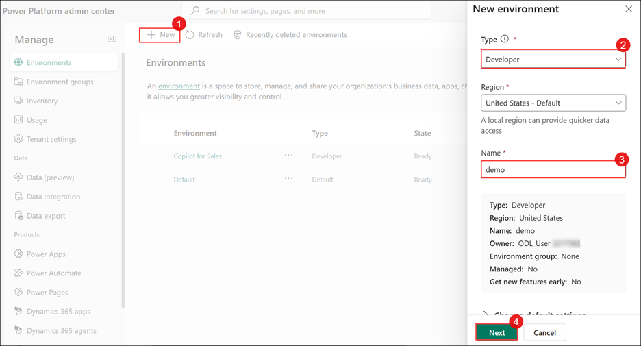

   Make sure to enable **Dynamic 365 Apps** and select **Sales Enterprise**.

   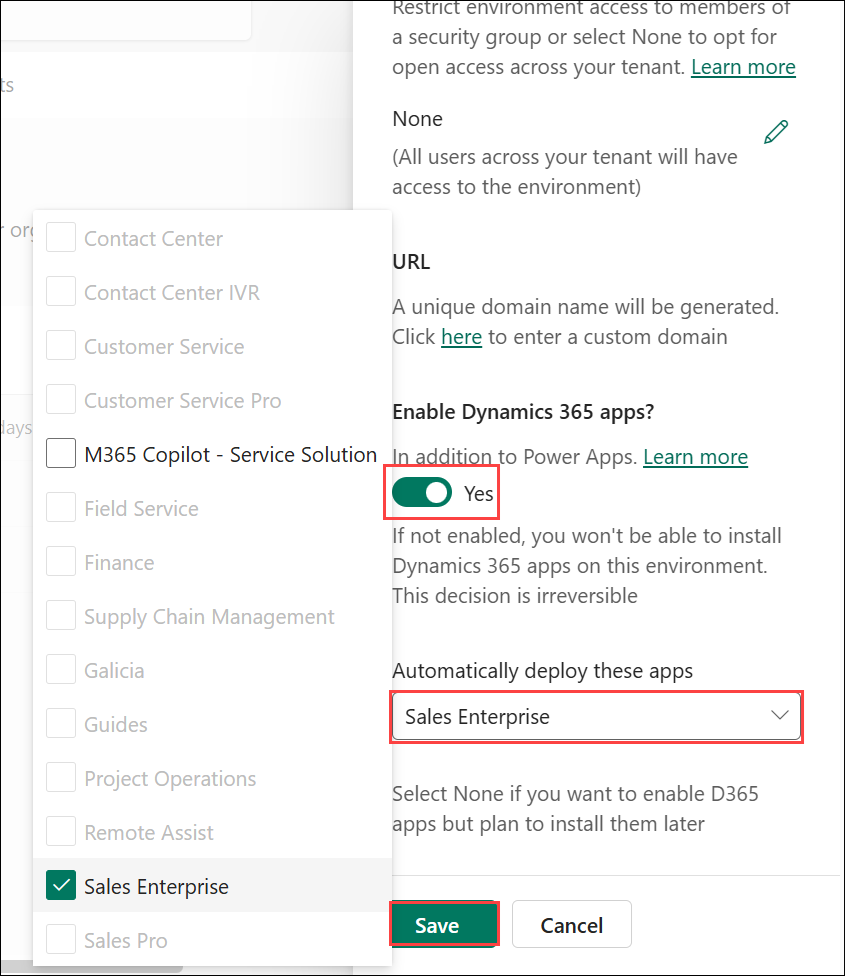

1. In **Outlook**, open a customer mail, click on **Apps** and select **Copilot for Sales**.
   
1. In the **Sales** pane, select **Sign in to Dynamics 365** in the Sign in to your CRM.

   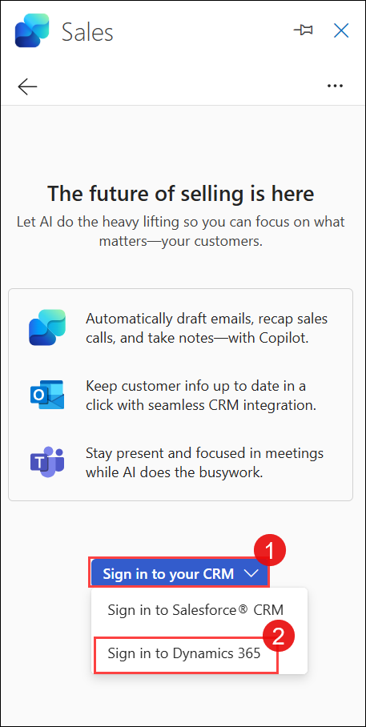
  
1. Choose the **Environment** where you wish to sign in and then click on **OK.**

   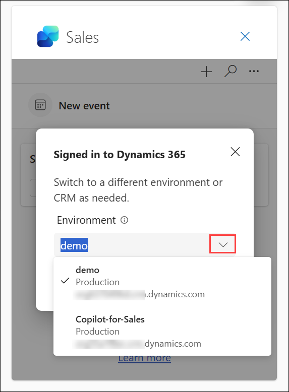

1. If promted, click on **Get Started**.
   
**Note:** - You can also sign in through Salesforce CRM:  
- Select your **Salesforce environment**, and then select **Sign in**.   
- In the confirmation message, select **Allow**.
- Enter your Salesforce credentials, and then select **Log In**.   
- Select **Allow**, and then select **Allow access**.

## Summary
In this lab, you have completed the following tasks:
- Accessed the Copilot for Sales app in Outlook and Teams
- Used Copilot for Sales with emails, meetings, and calendar events
- Signed in to CRM (Dynamics 365 / Salesforce) from Outlook to connect sales data
      
### You have successfully completed the lab. Now click on Next from the lower right corner to move on to the next page.

 
